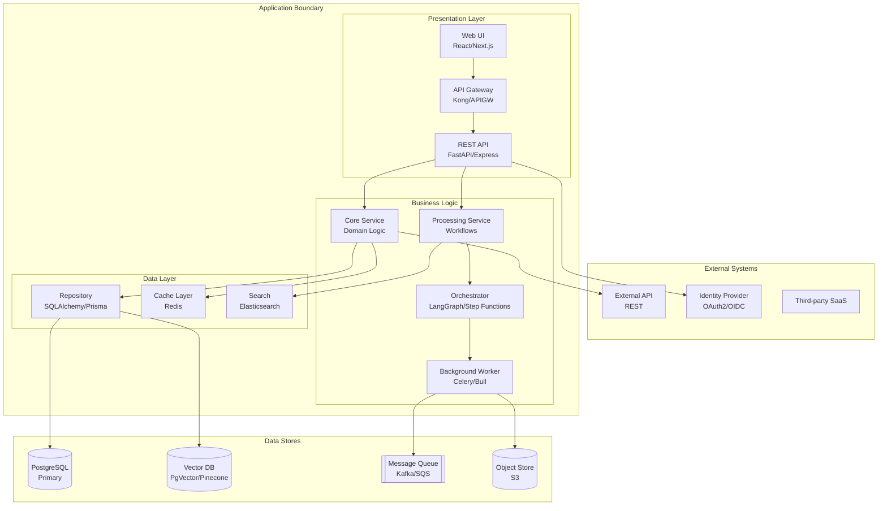
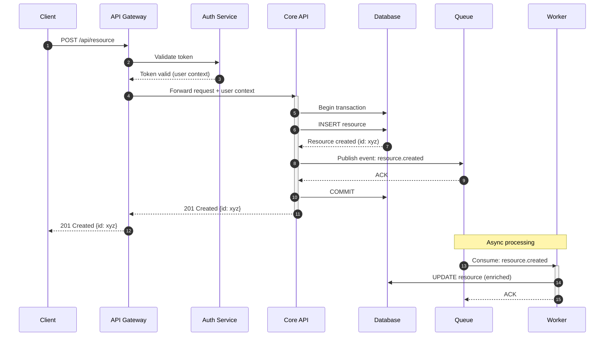
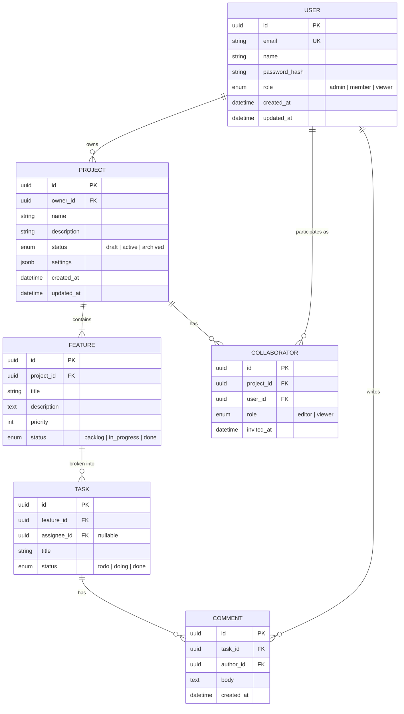
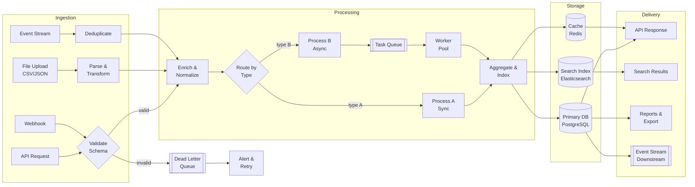
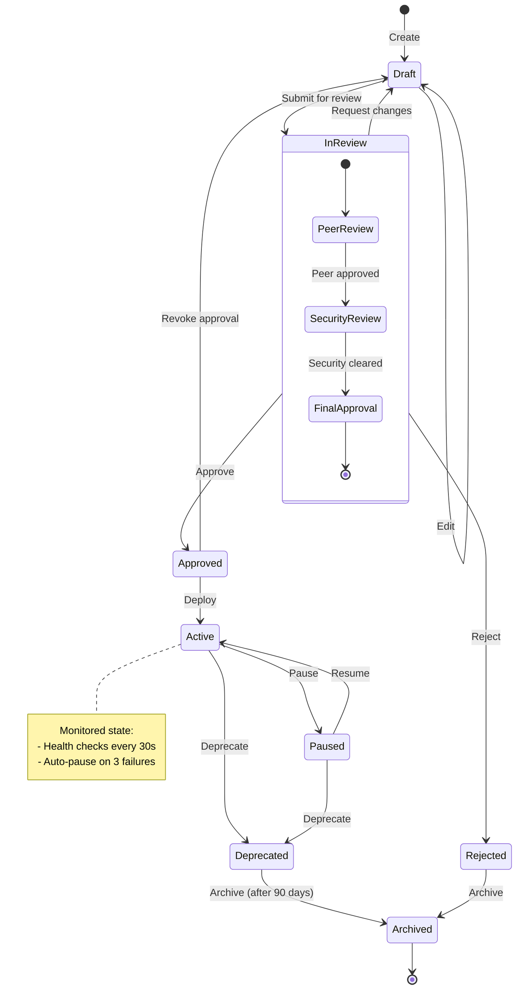
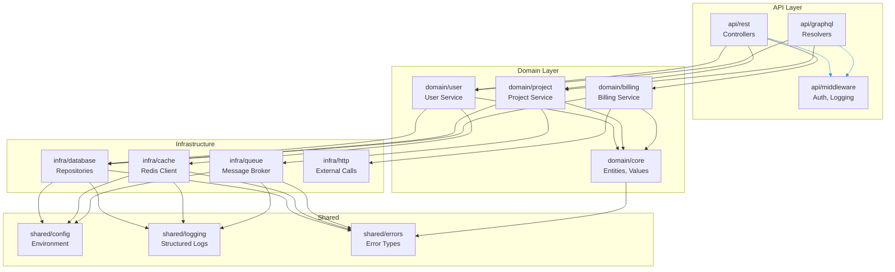
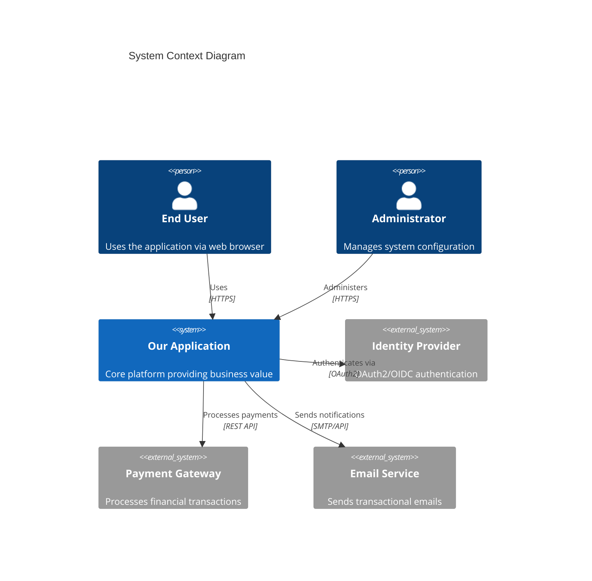
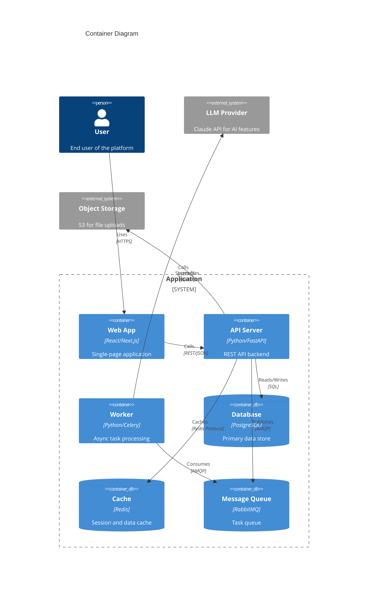
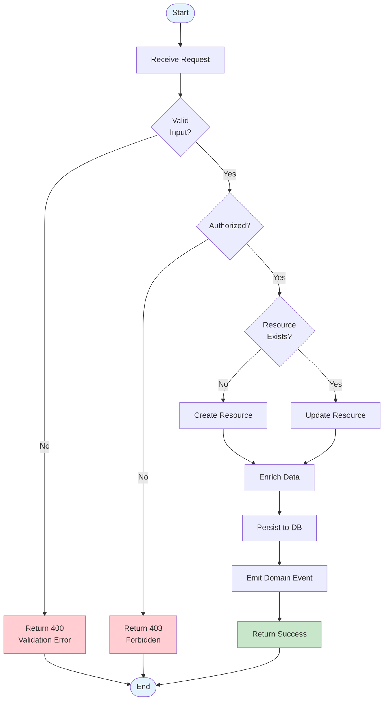
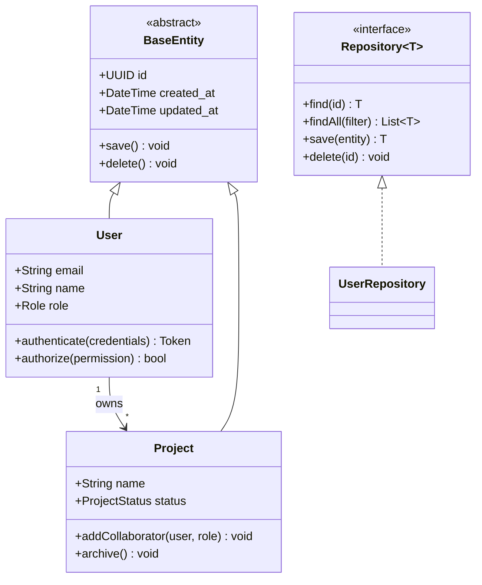

# Mermaid Diagram Template Library

Comprehensive template patterns for all supported diagram types. Adapt structure,
detail level, and styling to match the actual project context.

---

## 1. Architecture Diagram (C4-Style)

Use `graph TB` with layered subgraphs for system boundaries.



### Guidelines
- Subgraphs represent architectural boundaries (layers, services, external)
- Label nodes: `ID[Logical Name<br/>Technology]`
- Shapes: `[]` services, `[()]` databases, `[[]]` queues/streams, `{{}}` decisions, `([])` events
- Show primary data flow direction with arrows
- Max 4 subgraph nesting levels for readability

---

## 2. Sequence Diagram

For API interactions, service-to-service communication, and protocol flows.



### Guidelines
- Use `autonumber` for step tracking
- Show `activate`/`deactivate` for long-running operations
- `-->>` for responses, `->>` for requests
- `Note over` for cross-participant context
- Conditional flows:
  ```
  alt Success
      API-->>C: 200 OK
  else Failure
      API-->>C: 500 Error
  end
  ```
- Parallel operations:
  ```
  par Parallel enrichment
      W->>SVC1: Enrich data
  and
      W->>SVC2: Validate data
  end
  ```

---

## 3. Data Model (ERD)

Use `erDiagram` for relational models with entities, attributes, and relationships.



### Guidelines
- Include PK, FK, UK annotations
- Cardinality: `||--o{` (one-to-many), `||--||` (one-to-one), `}o--o{` (many-to-many)
- Verb labels on relationships
- Field types: `string`, `uuid`, `int`, `decimal`, `enum`, `datetime`, `jsonb`, `text`
- Show enum values: `enum status "active | inactive"`
- For NoSQL: use `classDiagram` with embedded document notation

---

## 4. Data Flow Diagram

Use `flowchart LR` for data pipelines showing ingestion, processing, storage, and delivery.



### Guidelines
- Left-to-right (LR) for pipelines; top-to-bottom (TB) for request/response
- Show transformation steps, not just connections
- Label edges: `-->|"JSON/REST"|`
- Include error paths (DLQ, retry, alerts)
- Use `[[]]` for queues/async boundaries
- Use `{}` diamonds for routing/decision points

---

## 5. State Machine Diagram

Use `stateDiagram-v2` for lifecycle models and status transitions.



### Guidelines
- Start with `[*] -->` for initial state
- End with `--> [*]` for terminal states
- Label transitions with triggering action/event
- Nested `state` blocks for composite states
- `note` blocks for constraints or behaviors
- `<<choice>>` for conditional transitions
- `<<fork>>` and `<<join>>` for parallel states

---

## 6. Dependency Graph

Use `graph TD` for module/package dependencies with architectural grouping.



### Guidelines
- Group by architectural layer/domain
- Show only direct dependencies (not transitive)
- `linkStyle` with colors for layer-to-layer connections
- Highlight circular dependencies: `linkStyle N stroke:red,stroke-width:3px`
- Package-level for large codebases, file-level for small ones
- High fan-in = high change impact (annotate these)

---

## 7. C4 Context Diagram

For formal system context documentation.



---

## 8. C4 Container Diagram



---

## 9. Workflow / Decision Flowchart

For business processes, approval flows, and decision trees.



### Guidelines
- `([])` for start/end (stadium shape)
- `{}` diamonds for decisions
- `[]` rectangles for actions
- Color-code: green success, red errors, blue start/end
- Max 2-3 decision branches per diamond
- Happy path in center/left

---

## 10. Class Diagram

For domain models and object hierarchies.



### Guidelines
- Stereotypes: `<<abstract>>`, `<<interface>>`, `<<enum>>`, `<<service>>`
- Visibility: `+` public, `-` private, `#` protected
- Include key methods only (not all)
- Generics: `Repository~T~`
- Relations: `<|--` inheritance, `<|..` implementation, `-->` association, `--o` aggregation, `--*` composition

---

## Styling Reference

### Theme Configuration

```mermaid
%%{init: {'theme': 'base', 'themeVariables': {
    'primaryColor': '#1976D2',
    'primaryTextColor': '#fff',
    'primaryBorderColor': '#0D47A1',
    'lineColor': '#546E7A',
    'secondaryColor': '#26A69A',
    'tertiaryColor': '#FFF3E0'
}}}%%
```

### Style Classes

```
classDef primary fill:#1976D2,stroke:#0D47A1,color:#fff
classDef secondary fill:#26A69A,stroke:#00897B,color:#fff
classDef danger fill:#E53935,stroke:#B71C1C,color:#fff
classDef success fill:#43A047,stroke:#1B5E20,color:#fff
classDef external fill:#78909C,stroke:#37474F,color:#fff

class API,SVC primary
class EXT1,EXT2 external
class ERROR danger
```

---

## Best Practices

1. **Readability over completeness** — 15-20 clear nodes beats 50 crowded ones
2. **One concept per diagram** — separate architecture from data flow
3. **Use project-specific names** — not generic placeholders
4. **Direction matters** — TB for hierarchies, LR for flows, TD for dependencies
5. **Label all edges** — unlabeled arrows are ambiguous
6. **Group logically** — subgraphs = real boundaries (network, team, domain)
7. **Keep text short** — use `<br/>` for line breaks within nodes

---

## Syntax Rules — Prevent Silent Failures

**One violation makes Mermaid drop the entire block silently** — the diagram vanishes in both the Markdown preview and the rendered HTML, with no error banner. These rules apply to every ```mermaid fence in every diagram type, not just sequenceDiagram. The AAH validator gate (`aah run core.gates.validate_mermaid`) enforces them deterministically — but this section exists so authors write clean fences the first time.

1. **Quote labels containing anything outside `[A-Za-z0-9_ ]`.** Any of `(` `)` `+` `.` `/` `:` `-` `,` `&` `<` `>` `"` `'` `[` `]` `{` `}` or non-ASCII in a `participant`/`actor`/node label → wrap it in double quotes.
   - ✅ `participant BE as "FastAPI+LangGraph (ALB)"`
   - ✅ `A["User (browser)"] --> B["API Gateway"]`
   - ❌ `participant BE as FastAPI+LangGraph (ALB)` — `+` and `(` break the lexer

2. **Never use `<placeholder>` or `<name>` in message/Note/edge text.** Mermaid parses `<` as an arrow, so `WHERE user_id=<id>` is read as a malformed arrow to a phantom participant.
   - ✅ `CLI->>RDS: DELETE audit_log WHERE user_id = {user_id}`
   - ✅ `CLI->>S3: DeleteObjects, prefix audit/user=user_id/`
   - ❌ `CLI->>S3: DeleteObjects, prefix audit/user=<user_id>/`

3. **No backticks inside message text.** They render as literal `` ` `` and are noise — keep identifiers plain: `intent_classifier` not `` `intent_classifier` ``.

4. **ASCII only in fence content.** Use `->` not `→`, `-` not `—`, straight quotes `"` `'`. Copy-paste from user prose is the usual culprit.

5. **No semicolons as statement separators in message text.** Mermaid can misread `BEGIN; UPDATE ...` — split into multiple arrows or join with commas.

6. **Reserved words as bare node/participant IDs are forbidden.** `end`, `subgraph`, `class`, `click`, `link` — always alias them (`participant END_NODE as "End"`).

7. **One diagram type per fence.** A `sequenceDiagram` block must not contain `flowchart`/`graph`/`erDiagram` directives, and vice versa. Split into separate fences.

### How this is validated

Any AAH phase that generates architecture docs (`aah-arch`, `aah-codebase-profile`) runs the validator gate before closing:

```bash
aah run core.gates.validate_mermaid --project-path "$PROJECT_DIR"
```

The gate scans every `.md` **and** `.html` under `.aah/architecture/` (recursive), extracts fences from ```mermaid blocks, `<script type="text/markdown">` tags, and `<div class="mermaid">` elements, and applies the 7 rules above. Non-zero exit lists each `<file> (block #N): line <L>: <reason>` — the phase agent then edits the offender, keeps any `.md`/`.html` pair in sync, and re-runs. Up to 3 attempts; still failing → the phase surfaces the remaining issues to the user.
