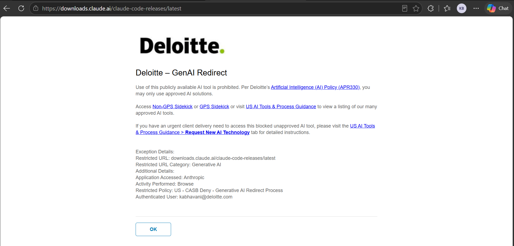

# AAH (Ascend Agentic Harness) Installation Guide

## Overview

This guide explains how to set up AAH on your machine. AAH is an AI-assisted
software delivery framework that runs inside Claude Code. The installer scripts
handle every prerequisite for you, then install AAH itself — so you do not need
to install any dependency by hand.

AAH is distributed **only** through the Deloitte **Ascend Exchange**. The
installer installs AAH from the harness source that shipped in that download.
**Nothing is cloned and no repository is contacted**, so you need no GitHub
account, credentials, or token to install AAH.

Installer scripts (both in this `installers/` folder):

- **Windows:** `AAH-Dependency-Installer.ps1` (PowerShell)
- **macOS / Linux:** `AAH-Dependency-Installer.sh` (Bash)

## Before You Start

- **Operating system:** Windows 10/11, macOS 12+, or Linux (Debian, Ubuntu, Fedora)
- **Memory:** 8 GB minimum, 16 GB recommended
- **Disk space:** 10 GB free
- **Permissions:** Administrator access on Windows, or `sudo` access on macOS/Linux
- **Internet:** active connection (for the prerequisite downloads)

## What Gets Installed, and Where

There is **one** install shape — nothing to choose:

| | |
|---|---|
| **Scope** | **Global.** `aah` works in every folder; skills, agents, and hooks link into `~/.claude` (Windows: `%USERPROFILE%\.claude`) |
| **Type** | **Global uv tool.** AAH is packaged into uv's managed environment. The unzipped folder can be deleted after install. |
| **Installed to** | Managed by uv (`%APPDATA%\uv\tools\aah` on Windows, `~/.local/share/uv/tools/aah` on macOS/Linux) |

## Step 1 — Get the Download

1. Open the AAH artifact page on **Ascend Exchange** and click **Download**.
   You get a file such as `ascend-agentic-harness@1.0.0.zip`.
2. Unzip it. Inside you'll find `README.md`, `artifact.yaml`, and
   `ascend-agentic-harness-main.zip`.
3. Unzip **`ascend-agentic-harness-main.zip`** too — this is a second, nested
   zip. It expands to `ascend-agentic-harness-main/`, which contains
   `pyproject.toml`, `aah/`, and `installers/`.
4. Open the **`installers`** folder.

> **Run the installer from inside `installers/`.** It locates the harness source
> by looking one folder up, so moving the script somewhere else on its own will
> not work.

## Step 2 — Windows Installation (PowerShell)

1. **Open Terminal in the installers folder**
   - Right-click the `installers` folder in File Explorer
   - Click **"Open in Terminal"**

2. **Run the script**

   ```powershell name=AAH-Dependency-Installer.ps1
   powershell -ExecutionPolicy Bypass -File ".\AAH-Dependency-Installer.ps1"
   ```

   > **Note:** If your execution policy already allows scripts, you can simply
   > run: `.\AAH-Dependency-Installer.ps1`

   The script auto-elevates to Administrator — you'll see a UAC prompt, click
   **Yes**. You do NOT need to manually open PowerShell as Admin.

3. **Answer the single prompt**
   - The installer shows what will be installed and asks:
     `Proceed with AAH harness installation? (yes/no)`
   - Type `yes` and press Enter

   There are **no** auth, IDE, mode, scope, or install-path questions.

4. **Wait for it to finish**

   The script will:

   - Check your system: Windows version, disk space, internet, SSL certificates
   - Install (if missing): Git, GitHub CLI, Python 3.12, Node.js, `uv`, AWS CLI v2, Claude Code
   - Remove any existing AAH install automatically
   - Install AAH as a global `uv` tool and run `aah setup` to link
     skills, agents, and hooks into `%USERPROFILE%\.claude`
   - Print a verification report

5. **Open a new terminal**

   Close it and open a new window so the updated `PATH` is loaded.

## Step 3 — macOS / Linux Installation (Bash)

1. **Open Terminal in the installers folder**
   - **macOS:** Right-click (Control-click) the `installers` folder in Finder →
     select **"New Terminal at Folder"** (from Services submenu)
   - **Linux:** Right-click → **"Open in Terminal"**
   - Or manually: `cd ~/Downloads/ascend-agentic-harness-main/installers`

2. **Make the script executable and run it**

   ```bash name=AAH-Dependency-Installer.sh
   chmod +x ./AAH-Dependency-Installer.sh
   ./AAH-Dependency-Installer.sh
   ```

   No elevation needed. No execution policy.

3. **Wait for it to finish**

   The script will:

   - Install (if missing): Homebrew (macOS), Git, Python 3.12+, Node.js 22+, `uv`,
     AWS CLI v2, Claude Code, GitHub CLI
   - Remove any existing AAH install automatically
   - Install AAH as a global `uv` tool and run `aah setup` to link
     skills, agents, and hooks into `~/.claude`
   - Run `uv tool update-shell` to persist `~/.local/bin` in your shell PATH
   - Print a verification report

4. **Open a new terminal**

   Close it and open a new one so the updated `PATH` is loaded.

> **WSL note:** run the installer from a Linux-native path (`~/…`) rather than a
> Windows mount (`/mnt/c/…`) for better performance. The script sets
> `UV_LINK_MODE=copy`, which handles the cross-filesystem hardlink warning
> automatically.

## Verify Your Installation

Open a **new terminal window** and run:

```bash name=verification-commands
aah status
git --version
python3 --version    # or: python --version (Windows)
node --version
uv --version
claude --version
gh --version
aws --version
```

Expected results:

- `aah status` → linked skills and hooks
- `git --version` → Git 2.x+
- `python3 --version` → Python 3.12+ (`python` or `python3` on Windows)
- `node --version` → Node.js v22+
- `uv --version` → installed `uv` version
- `claude --version` → Claude Code version (if not restricted)
- `gh --version` → GitHub CLI 2.x+
- `aws --version` → `aws-cli/2.x`

If any command shows **not found**:

1. Close the terminal and open a fresh one
2. If still missing, re-run the installer
3. If `aah` specifically is missing, run:

   ```bash name=terminal
   uv tool update-shell
   ```

   Then reopen the terminal.

## Updating AAH

Updating is the same flow as installing:

1. Download the new version from Ascend Exchange.
2. Unzip it, then unzip `ascend-agentic-harness-main.zip` inside it.
3. Run the installer from the new `installers/` folder.

The installer automatically removes the old AAH install and installs the new
version. No manual uninstall needed. No prompts about pass/override — same
flow every time.

## Troubleshooting

### "Could not find the AAH source next to this installer"

**Cause:** the script was run from somewhere other than the unzipped harness's
`installers/` folder, or the inner `ascend-agentic-harness-main.zip` was never
extracted.

**Fix:** extract both zips, then run the script from
`ascend-agentic-harness-main/installers/`. That folder's parent must contain
`pyproject.toml`.

### aah: command not found after install

**Fix:**

```bash name=terminal
uv tool update-shell
```

Then open a new terminal. On Windows, fully close and reopen the terminal so
`PATH` refreshes.

### Python >= 3.11 is not satisfied

**Cause:** `uv` resolved an interpreter older than 3.11.

**Fix:**

```bash name=terminal
uv python install 3.12
```

Then re-run the installer. `uv python list` shows what `uv` currently detects.

### Claude Code download is restricted

**Cause:** your corporate network blocks access to `https://downloads.claude.ai`.
The installer shows status "Restricted" instead of "Failed" — the rest of the
installation (AAH harness, tools) completes normally.

If you open `https://downloads.claude.ai/claude-code-releases/latest` in a browser,
you will see the Deloitte GenAI Redirect page:



**Fix:**
1. Visit **US AI Tools & Process Guidance > Request New AI Technology** to request
   access, or contact your ITS team to unblock `https://downloads.claude.ai` and
   `https://claude.ai`
2. Once unblocked, re-run the installer — it will install Claude Code automatically
3. Or install manually after unblocking:
   ```bash
   # Windows (PowerShell)
   irm https://claude.ai/install.ps1 | iex

   # macOS / Linux
   curl -fsSL https://claude.ai/install.sh | bash
   ```

### The install seems stuck for a minute or two

Not stuck — the first install resolves and downloads roughly 200 Python
packages. Allow up to about 3 minutes.

### aah: command not found on macOS (PATH not persisted)

**Cause:** `~/.local/bin` is not in your shell PATH. The installer runs
`uv tool update-shell` which should handle this, but if it didn't work:

**Fix — How to Add the Path:**

1. Open your Terminal application
2. Open your configuration file in a text editor:
   ```bash
   nano ~/.zshrc
   ```
3. Add this line to the bottom of the file:
   ```bash
   export PATH="$HOME/.local/bin:$PATH"
   ```
4. Save the file by pressing **Ctrl + O**, then **Enter**, and exit by pressing
   **Ctrl + X**
5. Apply the changes immediately to your current window:
   ```bash
   source ~/.zshrc
   ```

After this, `aah` and `claude` will work in every new terminal session.

### Failed to hardlink files; falling back to full copy (WSL only)

**Cause:** running from a Windows-mounted folder such as `/mnt/c/…`. Hardlinks
cannot cross filesystems.

**Fix:** none needed — the script sets `UV_LINK_MODE=copy` for you. For faster
installs, move the unzipped harness into the Linux filesystem (`~/…`) and run the
installer from there.


## What to Do After Installation

1. Open a new terminal
2. Navigate to your project folder
3. Start Claude Code:

   ```bash name=terminal
   claude
   ```

4. Initialize your AAH project:

   ```text name=command
   /aah-init-project
   ```

5. Begin the delivery sequence:

   ```text name=command
   /aah-discuss
   ```
